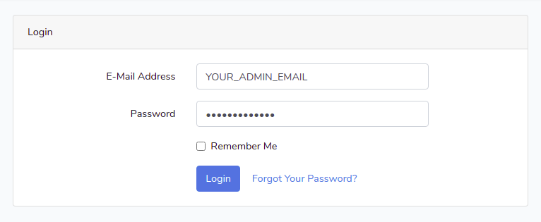
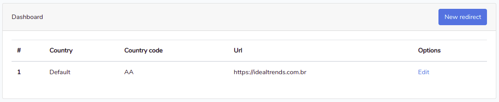
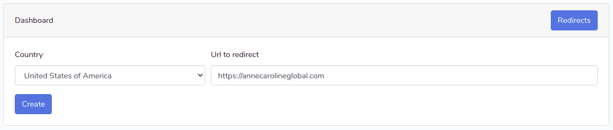

# Ideal Redirect

Ideal Redirect is an application to redirect your visitors to another website based on their ip.

### Configuration
```shell script
composer install
composer-dump autoload
cp .env.example .env
php artisan key:generate
```
First you need to set your admin credentials in your .env file

```dotenv
ADMIN_EMAIL=YOUR_ADMIN_EMAIL
ADMIN_PASSWORD=YOUR_PASSWORD
``` 
After that you can run the migrations with the seeds
```shell script
php artisan migrate --seed
```
Now you need to access the /redirects url in your project and log in with your credentials registered in your .env file



After you log in, you will see the default redirect details, pointing to https://idealtrends.com.br, you can edit if you want



When you click at "New redirect" you will be able to create a new redirect configuration, you must specify the user country and the url to get redirected.



When you access the root url in your project, you will be redirected based on your country to the registered urls. If you access from a unconfigured redirect country, you will be redirected to the default configuration.
